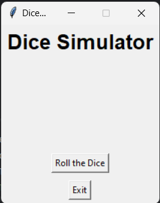
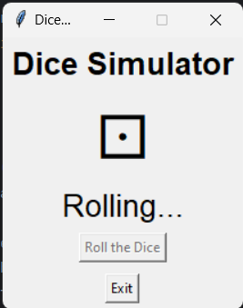
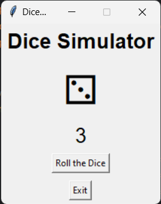

# Dice-Simulator

A Graphical User Interface that simulates the rolling of a dice. The user clicks on the button to roll the dice and the
dice is rolled and the number is displayed on the screen. When the "Roll the Dice" button is clicked, the dice is rolled
and the number is displayed on the screen. The user can roll the dice starts to roll and the button is disabled for the
amount of time until the output is shown.

## Screenshots

